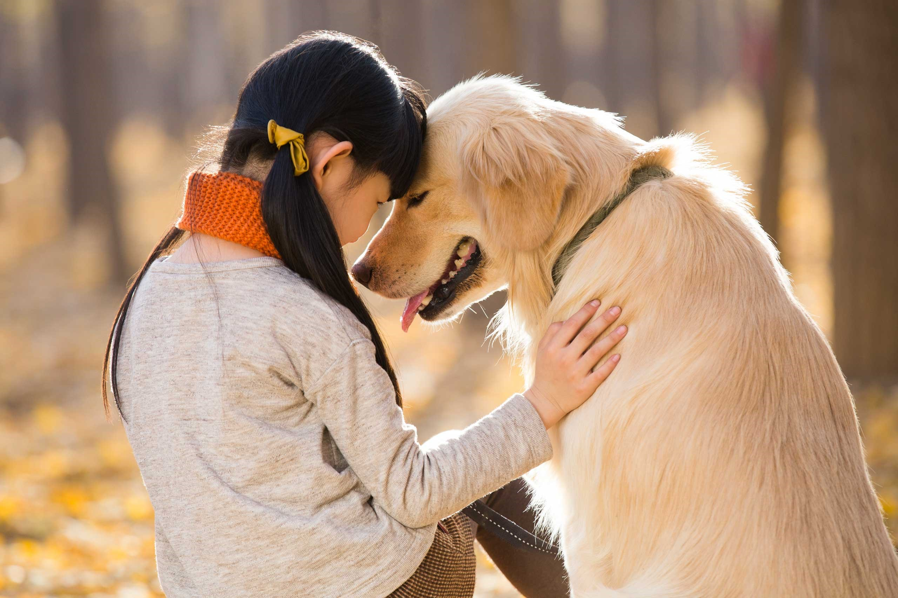
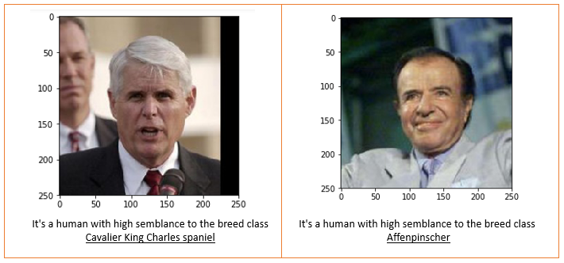
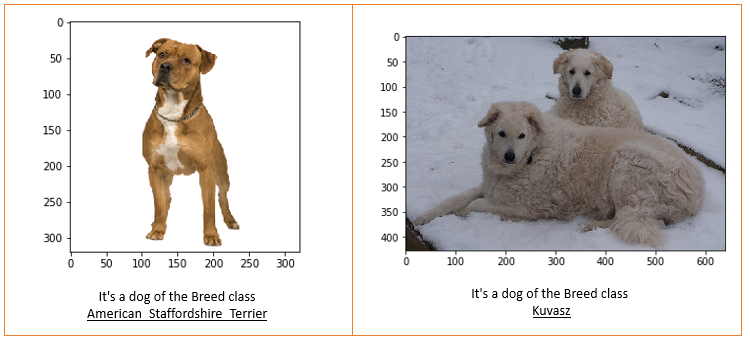
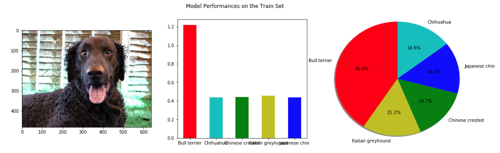
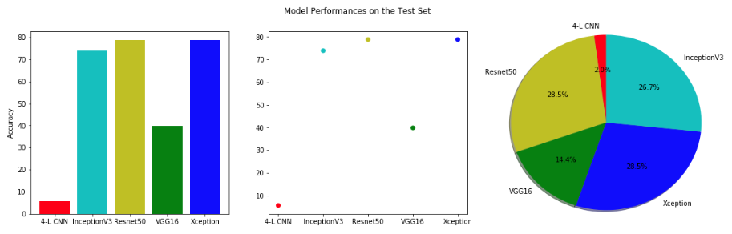

# DSND-CNN-Capstone-Project
Udacity Dog Breed CNN Classifier




## Table of Contents
1. [Project Motivation and Overview](###project-motivation-and-overview)
2. [Requirement](###requirement)
3. [File Descriptions](###file-descriptions)
4. [Implementation](###implementation)
5. [Results](###results)
6. [Licensing and Acknowledgements](###licensing-and-acknowledgements)


### 1. Project Motivation and Overview
This project is the Udacity Data Scientist Nanodegree Capstone Project. It presents the claasification of human and dog images using Convolutional Neural Network. 


### 2. Requirement
- Python 3
- sklearn
- Numpy
- TensorFlow  
- keras
- glob
- cv2
- matplotlib
- tqdm
- PIL


### 3. File Descriptions
- There are 4 folders, 1 notebooks and 1 python script in this repo. The **bottleneck_features** folder should contain the VGG16 bottleneck features which is implemented in the Step 4 of the dog_app.ipynb file.

- The **haarcascades** folder should contain the OpenCV haarcascades face detector model which is implemented in the Step 1 of the dog_app.ipynb file.

- The **images** folder should contain the dataset images. It should be divided into subfolders titled **train**, **valid** and **test** respectively

- The **saved_models** folder should contain the files for the pretrained ResNet50, VGG16 and Xception models used in the Step 2, 4 and 5 sessions of the dog_app.ipynb file respectively.

- The **extract_bottleneck_features.py** script contains the caller functions for downloading the pretrained models and predicting models with them.

- The **dog_app.ipynb** notebook is the main file which displays the classifcation models and illustartions.


### 4. Implementation
- To implementation of all the imported models and built models are in the **dog_app.ipynb** notebook which is implemented using the Keras open-source neural network library with a TensorFlow backend. 

```bat
open cmd
>>> jupyter notebook
cd to your file directory
open dog_app.ipynb
```


### 5. Results
The main findings of the code can be found at the post available [here.](https://medium.com/@oluwasanmiariyo/dog-breed-prediction-using-convolutional-neural-network-45d9cd4e4205)










### 6. Licensing and Acknowledgements
Credit to Udacity Data Science Nanodegree for the knoweldge and for the data. Feel free to use the code here as you would like following the instruction in the LICENSE.txt


