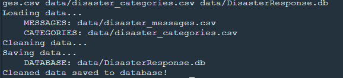
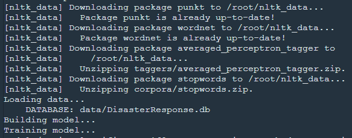
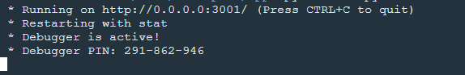
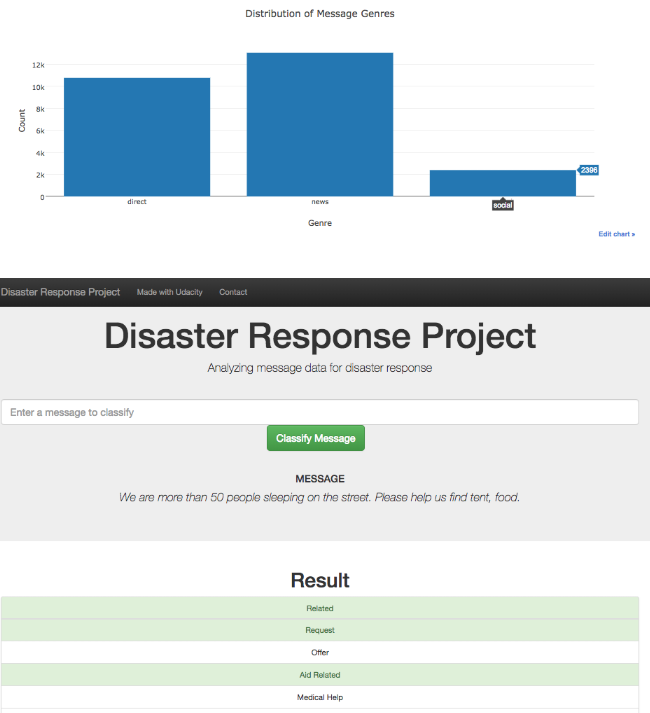

# Disaster-Response-Pipeline
Building a ML pipeline to categorize emergency messages based on the needs of sender


## Table of Contents
1. [Project Motivation](###project-motivation)
2. [Requirement](###requirement)
3. [File Descriptions](###file-descriptions)
4. [Implementation](###implementation)
5. [Licensing and Acknowledgements](###licensing-and-acknowledgements)


### 1. Project Motivation
As part of Udacity Data Scientist NanoDegree Project for categorizing emergency messages for first responder services 

### 2. Requirement
- Python 3
- Pandas
- Numpy
- sqlalchemy 
- nltk
- sklearn


### 3. File Descriptions
- There are 3 folders, 2 notebooks and 2 CSV data files in this repo. The **data** folder contains two csv files which has details of the emergency messages and an etl script for loading the data, cleaning it and passing it into a database. 

- The **model** folder contain the ML script for training model which could categorize messages into several classes and a pickel

- The **App** folder has the flask scripts for displaying the web interface where users can send their messages. 


### 4. Implementation
- To load the data from csv files and clean the data into the daatbase

```bat
python data/process_data.py data/disaster_messages.csv data/disaster_categories.csv data/DisasterResponse.db
```



- To train ML model on the database contents

```bat
python models/train_classifier.py data/DisasterResponse.db models/classifier.pkl
```




- To load up the web interface
```bat
cd app
python run.py
```



- Web Interface




### 5. Licensing and Acknowledgements
Credit to Udacity Data Science Naanodegree for the knoweldge and the Figure8 corporation for the data. Feel free to use the code here as you would like!

